# Jai Protobuf Timings

Basic timing comparison between jai-protobuf and the official C++ Protobuf implementation.

## Plots

To generate the plots, build each of the sub-projects as per their readme file
(for release builds). Then run the release builds. This generates local test
results file in protobuf binary format. The `analyse_results.jai` program loads these
and generates mermaid plots which can be rendered in markdown (copy pasted below).

All plots show the time taken (e.g. to serialize or deserialize) in
milliseconds. Lower is better.

```mermaid
gantt
    title test_repeated_ints (3.6 MB)
    dateFormat x
    axisFormat %s.%L ms
    section Serialize
        Jai Default : 0, 4.34315s
        Jai Arena : 0, 3.964517s
        Jai Buffer : 0, 2.798507s
        Jai (no asserts) Default :active, 0, 4.787348s
        Jai (no asserts) Arena :active, 0, 5.111928s
        Jai (no asserts) Buffer :active, 0, 3.105268s
        C++ Default :done, 0, 2.844878s
        C++ Arena :done, 0, 3.166098s
        C++ Buffer :done, 0, 3.21486s
    section Deserialize
        Jai Default : 0, 6.800913s
        Jai Arena : 0, 5.333118s
        Jai Buffer : 0, 5.32909s
        Jai (no asserts) Default :active, 0, 5.770382s
        Jai (no asserts) Arena :active, 0, 4.510551s
        Jai (no asserts) Buffer :active, 0, 4.498309s
        C++ Default :done, 0, 4.126291s
        C++ Arena :done, 0, 3.086156s
        C++ Buffer :done, 0, 3.042525s
    section Cleanup
        Jai Default : 0, 0.280529s
        Jai (no asserts) Default :active, 0, 0.257511s
        C++ Default :done, 0, 0.470621s
    section Markers
        10ms : milestone, m1, 0, 20s
```

```mermaid
gantt
    title test_repeated_zigzag (3.7 MB)
    dateFormat x
    axisFormat %s.%L ms
    section Serialize
        Jai Default : 0, 4.960173s
        Jai Arena : 0, 4.362225s
        Jai Buffer : 0, 3.042585s
        Jai (no asserts) Default :active, 0, 5.134602s
        Jai (no asserts) Arena :active, 0, 4.960659s
        Jai (no asserts) Buffer :active, 0, 3.153309s
        C++ Default :done, 0, 3.131891s
        C++ Arena :done, 0, 3.23374s
        C++ Buffer :done, 0, 3.406066s
    section Deserialize
        Jai Default : 0, 6.651107s
        Jai Arena : 0, 5.59883s
        Jai Buffer : 0, 5.618107s
        Jai (no asserts) Default :active, 0, 5.961678s
        Jai (no asserts) Arena :active, 0, 4.873041s
        Jai (no asserts) Buffer :active, 0, 4.87481s
        C++ Default :done, 0, 5.11038s
        C++ Arena :done, 0, 4.079433s
        C++ Buffer :done, 0, 4.16002s
    section Cleanup
        Jai Default : 0, 0.250407s
        Jai (no asserts) Default :active, 0, 0.250871s
        C++ Default :done, 0, 0.500755s
    section Markers
        10ms : milestone, m1, 0, 20s
```

```mermaid
gantt
    title test_repeated_floats (3.8 MB)
    dateFormat x
    axisFormat %s.%L ms
    section Serialize
        Jai Default : 0, 0.715026s
        Jai Arena : 0, 0.168145s
        Jai Buffer : 0, 0.169304s
        Jai (no asserts) Default :active, 0, 0.695293s
        Jai (no asserts) Arena :active, 0, 0.12084s
        Jai (no asserts) Buffer :active, 0, 0.135135s
        C++ Default :done, 0, 0.090893s
        C++ Arena :done, 0, 0.160164s
        C++ Buffer :done, 0, 0.172228s
    section Deserialize
        Jai Default : 0, 0.572822s
        Jai Arena : 0, 0.233361s
        Jai Buffer : 0, 0.227041s
        Jai (no asserts) Default :active, 0, 0.539441s
        Jai (no asserts) Arena :active, 0, 0.144334s
        Jai (no asserts) Buffer :active, 0, 0.158439s
        C++ Default :done, 0, 0.165609s
        C++ Arena :done, 0, 0.220165s
        C++ Buffer :done, 0, 0.216729s
    section Cleanup
        Jai Default : 0, 0.144029s
        Jai (no asserts) Default :active, 0, 0.138152s
        C++ Default :done, 0, 0.000147s
    section Markers
        10ms : milestone, m1, 0, 20s
```

```mermaid
gantt
    title test_repeated_strings (35.2 MB)
    dateFormat x
    axisFormat %s.%L ms
    section Serialize
        Jai Default : 0, 15.24555s
        Jai Arena : 0, 11.835906s
        Jai Buffer : 0, 10.091934s
        Jai (no asserts) Default :active, 0, 14.460114s
        Jai (no asserts) Arena :active, 0, 11.118865s
        Jai (no asserts) Buffer :active, 0, 9.919726s
        C++ Default :done, 0, 18.430537s
        C++ Arena :done, 0, 13.131528s
        C++ Buffer :done, 0, 13.242558s
    section Deserialize
        Jai Default : 0, 14.682982s
        Jai Arena : 0, 11.473001s
        Jai Buffer : 0, 11.438935s
        Jai (no asserts) Default :active, 0, 10.907949s
        Jai (no asserts) Arena :active, 0, 7.652731s
        Jai (no asserts) Buffer :active, 0, 7.497309s
        C++ Default :done, 0, 81.873521s
        C++ Arena :done, 0, 39.423258s
        C++ Buffer :done, 0, 37.999314s
    section Cleanup
        Jai Default : 0, 4.256266s
        Jai (no asserts) Default :active, 0, 4.273207s
        C++ Default :done, 0, 46.026607s
    section Markers
        10ms : milestone, m1, 0, 20s
```

```mermaid
gantt
    title test_repeated_maps_ints (9.5 MB)
    dateFormat x
    axisFormat %s.%L ms
    section Serialize
        Jai Default : 0, 14.854857s
        Jai Arena : 0, 14.156251s
        Jai Buffer : 0, 8.065217s
        Jai (no asserts) Default :active, 0, 13.89331s
        Jai (no asserts) Arena :active, 0, 12.598796s
        Jai (no asserts) Buffer :active, 0, 7.080132s
        C++ Default :done, 0, 81.006099s
        C++ Arena :done, 0, 52.51317s
        C++ Buffer :done, 0, 55.215607s
    section Deserialize
        Jai Default : 0, 58.133545s
        Jai Arena : 0, 54.323349s
        Jai Buffer : 0, 54.173507s
        Jai (no asserts) Default :active, 0, 51.067858s
        Jai (no asserts) Arena :active, 0, 47.587862s
        Jai (no asserts) Buffer :active, 0, 46.763882s
        C++ Default :done, 0, 43.560041s
        C++ Arena :done, 0, 30.420694s
        C++ Buffer :done, 0, 30.746373s
    section Cleanup
        Jai Default : 0, 0.563285s
        Jai (no asserts) Default :active, 0, 0.601231s
        C++ Default :done, 0, 180.168408s
    section Markers
        10ms : milestone, m1, 0, 20s
```

```mermaid
gantt
    title test_repeated_maps_with_strings (50.0 MB)
    dateFormat x
    axisFormat %s.%L ms
    section Serialize
        Jai Default : 0, 19.927433s
        Jai Arena : 0, 18.555288s
        Jai Buffer : 0, 16.337406s
        Jai (no asserts) Default :active, 0, 19.123632s
        Jai (no asserts) Arena :active, 0, 17.345777s
        Jai (no asserts) Buffer :active, 0, 15.398454s
        C++ Default :done, 0, 44.059321s
        C++ Arena :done, 0, 36.320501s
        C++ Buffer :done, 0, 33.193725s
    section Deserialize
        Jai Default : 0, 24.836416s
        Jai Arena : 0, 21.870133s
        Jai Buffer : 0, 21.701608s
        Jai (no asserts) Default :active, 0, 22.717685s
        Jai (no asserts) Arena :active, 0, 19.469457s
        Jai (no asserts) Buffer :active, 0, 19.491777s
        C++ Default :done, 0, 26.229072s
        C++ Arena :done, 0, 17.436432s
        C++ Buffer :done, 0, 17.309293s
    section Cleanup
        Jai Default : 0, 5.462001s
        Jai (no asserts) Default :active, 0, 5.271969s
        C++ Default :done, 0, 46.440122s
    section Markers
        10ms : milestone, m1, 0, 20s
```

```mermaid
gantt
    title test_submessages (33.4 MB)
    dateFormat x
    axisFormat %s.%L ms
    section Serialize
        Jai Default : 0, 36.373355s
        Jai Arena : 0, 34.363119s
        Jai Buffer : 0, 14.979541s
        Jai (no asserts) Default :active, 0, 32.212246s
        Jai (no asserts) Arena :active, 0, 29.674329s
        Jai (no asserts) Buffer :active, 0, 13.191644s
        C++ Default :done, 0, 29.863336s
        C++ Arena :done, 0, 29.001687s
        C++ Buffer :done, 0, 25.992598s
    section Deserialize
        Jai Default : 0, 63.490041s
        Jai Arena : 0, 54.809998s
        Jai Buffer : 0, 53.645662s
        Jai (no asserts) Default :active, 0, 55.736894s
        Jai (no asserts) Arena :active, 0, 47.206382s
        Jai (no asserts) Buffer :active, 0, 46.295267s
        C++ Default :done, 0, 117.123226s
        C++ Arena :done, 0, 50.361708s
        C++ Buffer :done, 0, 49.948575s
    section Cleanup
        Jai Default : 0, 0.651492s
        Jai (no asserts) Default :active, 0, 0.637524s
        C++ Default :done, 0, 55.361613s
    section Markers
        10ms : milestone, m1, 0, 20s
```

